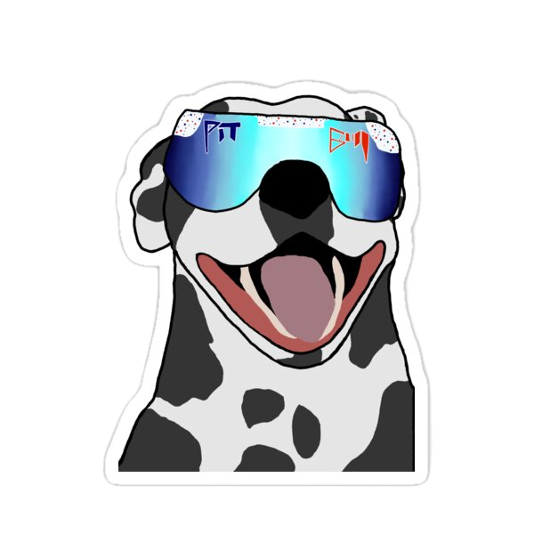

## ShelterBy!

  

 

This app was born out of a desire to optimize a very manual casting process. Instead of sifting through resumes one by one, Cast allows Talent to setup a profile and have Casting Directors reach out to them. It's more simple, streamined, and modern. 

## Getting Started

- <a href="https://shelterby.netlify.app/dog/2">Here</a> is a link to the deployed application. 
- <a href="https://whimsical.com/shelterby-84ddoigSLPjsmfFEE7MGek">Here</a> is a link to the the app's planning materials. 

## Features

- Streamlined user experience flow.
- Separate Talent and Casting director profiles.
- The ability to share things like headshots, a demo reel, and important details with casting directors.
- Our powerful search tool allows talent to connect with others for networking purposes and Casting Directors to filter search results with relevant criteria to making a casting decision.
- Casting directors can create lists to reference back to (i.e. Great Comedic Actors, or Professional Stuntmen).

## Technology

- React
- JavaScript
- TypeScript
- PostgreSQL
- Sequelize
- Node.js
- Express.js
- Netlify
- Fly.io
- Cloudinary

## Future Enhancements

 - Present dogs that are geographically near the user
 - Upload an album of pictures for a dog