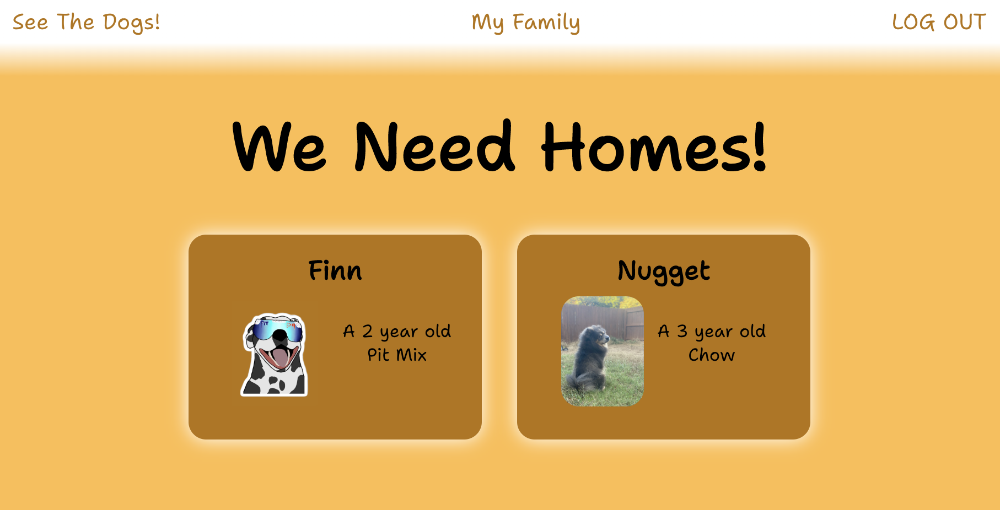
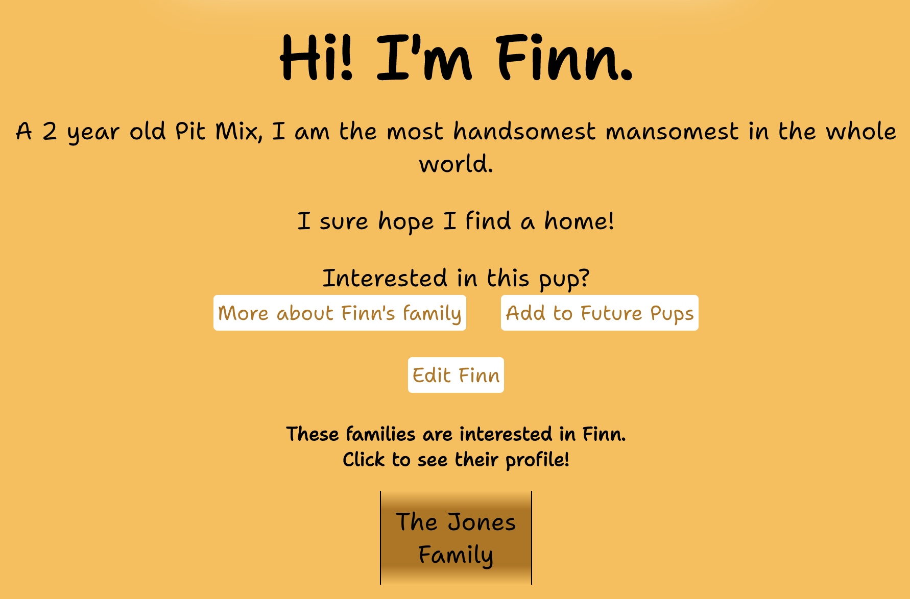

## ShelterBy!

  

  
  

 

<h4 align="center">I know I can speak for Atlanta when I say that animal shelters are overflowing.</h4>

 Especially during the pandemic- families have been home more and thus feel more available for a furry friend. <strong>However</strong>, people are suddenly unable to care for their pets, whether because they have returned to work in person and are unavailable, or they have not been able to work and funds have dried up. 

 What does this mean? These new pets can't stick around. Something needs to happen. This causes an influx of animals at shelters or worse: in the wild. 

 <strong>ShelterBy</strong> can help. We give an alternate to sending a furry friend to a shelter or off as a stray. 

## Getting Started

- <a href="https://shelterby.netlify.app/dog/2">Here</a> is a link to the deployed application. 
- <a href="https://whimsical.com/shelterby-84ddoigSLPjsmfFEE7MGek">Here</a> is a link to the the app's planning materials. 

## Features

- List a dog that needs a home.
- Browse dogs that need homes.
- Grab a family's contact information to reach out!

## Technology

- React
- JavaScript
- TypeScript
- PostgreSQL
- Sequelize
- Node.js
- Express.js
- Netlify
- Fly.io
- Cloudinary

## Future Enhancements

 - Present dogs that are geographically near the user
 - Upload an album of pictures for a dog
 - Expand to other species.